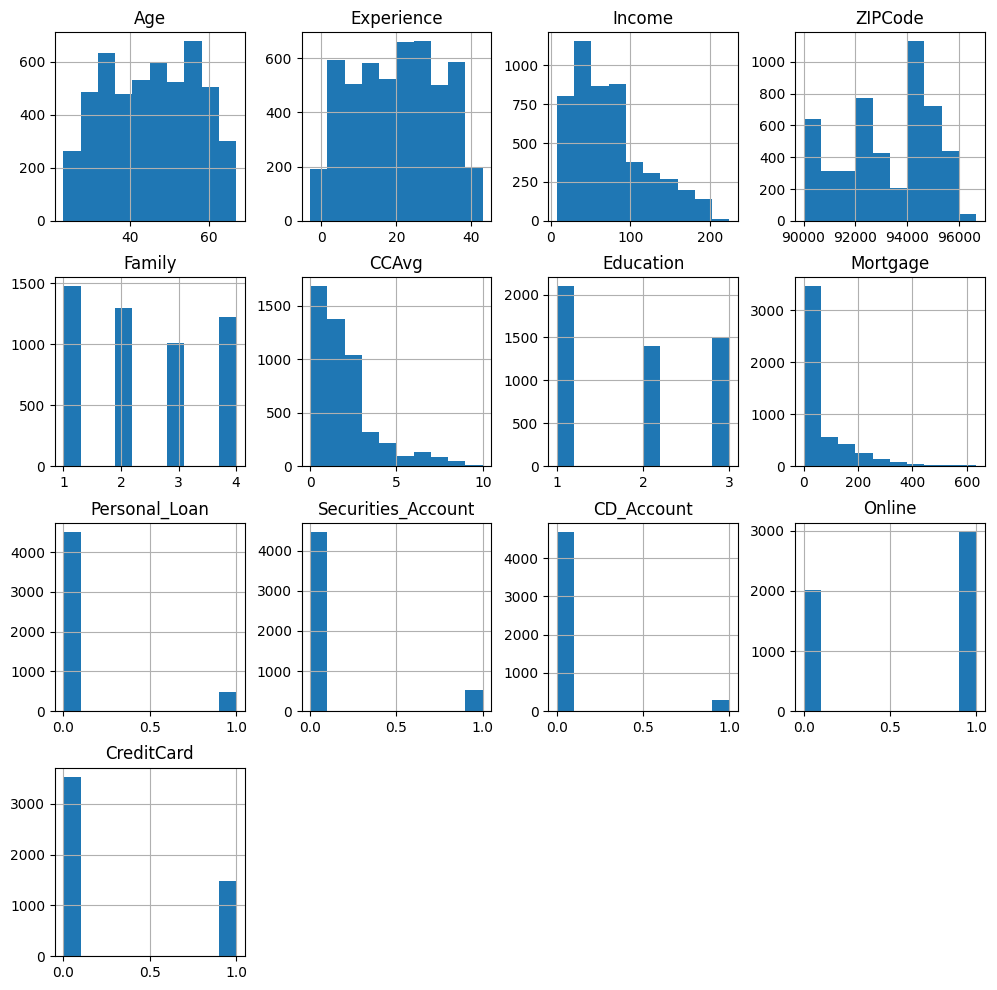
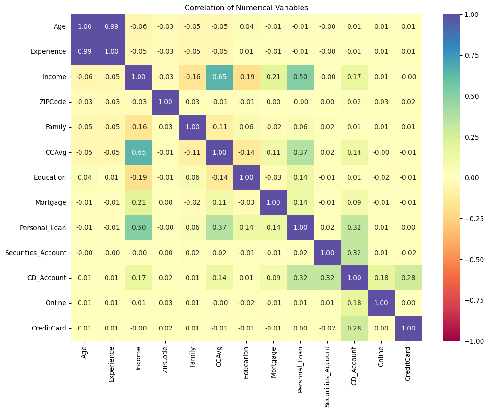
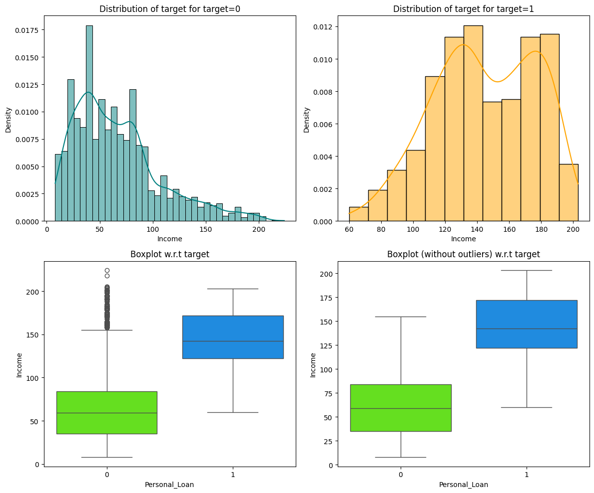
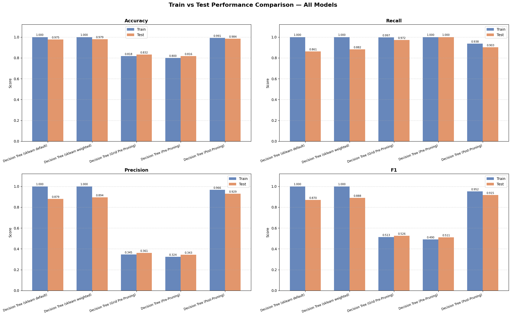
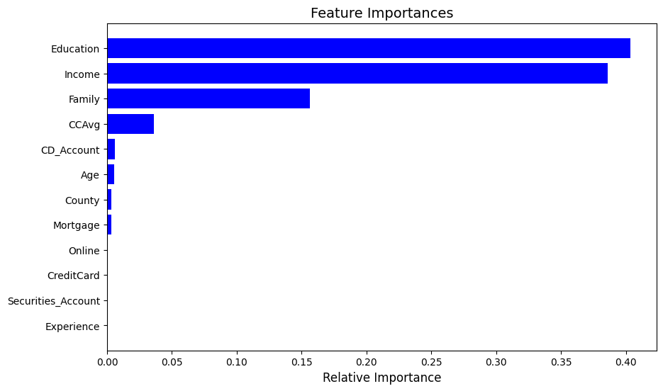
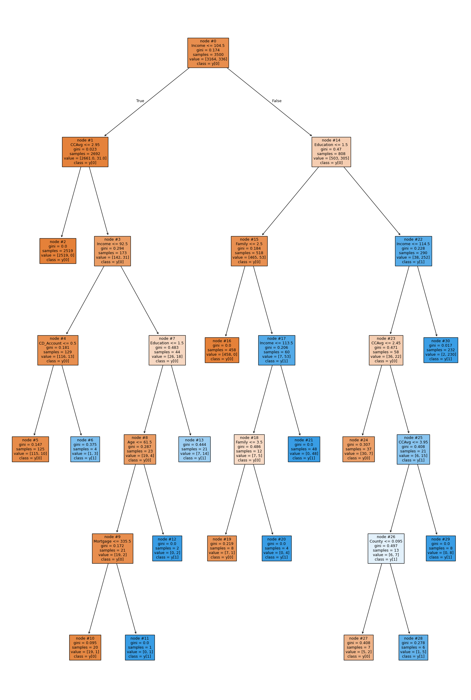

# Personal Loan Campaign — AllLife Bank

A machine learning project that predicts which liability customers (depositors) of AllLife Bank are most likely to accept a personal loan offer, so the marketing team can target future campaigns more effectively.

## Business Context

AllLife Bank has a large base of liability customers (depositors) but a much smaller base of asset customers (borrowers). The bank wants to grow its loan business by converting existing depositors into personal loan customers, without losing them as depositors.

A previous marketing campaign achieved a 9% loan conversion rate. The retail marketing department wants a more targeted approach to significantly improve on this baseline by focusing outreach on customers with the highest likelihood of accepting a loan offer.

## Objective

Build a classification model that:
1. Predicts whether a liability customer will accept a personal loan offer.
2. Identifies the customer attributes that most strongly drive loan acceptance.
3. Recommends customer segments the marketing team should prioritize.

## Dataset

The dataset (`Loan_Modelling.csv`, referenced from the notebook) contains 5,000 customer records with the following fields:

| Column | Description |
|---|---|
| `ID` | Customer ID |
| `Age` | Customer's age in completed years |
| `Experience` | Years of professional experience |
| `Income` | Annual income (in thousand dollars) |
| `ZIP Code` | Home address ZIP code |
| `Family` | Family size of the customer |
| `CCAvg` | Average monthly credit card spending (in thousand dollars) |
| `Education` | Education level (1: Undergrad, 2: Graduate, 3: Advanced/Professional) |
| `Mortgage` | Value of house mortgage, if any (in thousand dollars) |
| `Personal_Loan` | Target variable — did the customer accept the personal loan offer? |
| `Securities_Account` | Does the customer have a securities account with the bank? |
| `CD_Account` | Does the customer have a certificate of deposit account with the bank? |
| `Online` | Does the customer use internet banking? |
| `CreditCard` | Does the customer use a credit card issued by another bank? |

## Repository Contents

- `Machine_Learning_Personal_Loan_Campaign.ipynb` — end-to-end analysis notebook covering data loading, EDA, preprocessing, model building, tuning, and business recommendations.
- `images/` — plots exported from the notebook, used to illustrate the analysis and results below.

## Approach

1. **Data Overview & Cleaning** — inspected data types, checked for duplicates/missing values, mapped invalid ZIP codes to approximate counties, and dropped the non-informative `ID` column.
2. **Exploratory Data Analysis**
   - *Univariate analysis* of Age, Income, CCAvg, Mortgage, Family size, and categorical flags (Securities Account, CD Account, Online, CreditCard).
   - *Bivariate analysis* of each feature against the `Personal_Loan` target, plus a correlation heatmap to identify redundant features (e.g., Age vs. Experience) and top predictors.
3. **Data Preprocessing** — encoding of categorical variables and a train/test split for model evaluation.
4. **Model Building** — Decision Tree classifiers were trained and compared:
   - Default Decision Tree
   - Decision Tree with class weights (to address class imbalance, since only ~9.6% of customers accepted the prior offer)
   - Decision Tree with pre-pruning (max depth / hyperparameters tuned via `GridSearchCV`)
   - Decision Tree with post-pruning (cost-complexity pruning)
5. **Model Evaluation** — models were compared on Accuracy, Recall, Precision, and F1-score for both train and test sets to select the model that generalizes best (rather than simply maximizing training performance).

## Exploratory Data Analysis

**Distribution of numerical features** — Income, CCAvg, and Mortgage are all strongly right-skewed, while Age is fairly evenly spread between 40–60 years:



**Correlation heatmap** — `Income` (0.50) and `CCAvg` (0.37) are the numerical features most correlated with `Personal_Loan`; `Age` and `Experience` are almost perfectly correlated with each other (0.99), so only one is needed for modeling:



**Income vs. loan acceptance** — the single strongest visual signal in the data: customers who accepted the loan (target = 1) have a much higher and tighter income distribution than those who didn't:



## Key Results

The **post-pruned Decision Tree** was selected as the final model, offering the best generalization:

| Metric | Test Score |
|---|---|
| Accuracy | ≈ 0.984 |
| Recall | ≈ 0.903 |
| Precision | ≈ 0.929 |
| F1-score | ≈ 0.915 |

It showed a much smaller train/test performance gap than the default and class-weighted trees, which overfit the training data:



### Top Predictors of Loan Acceptance
- **Income** — the primary driver; customers with income below ~$104.5K rarely accept the loan.
- **CCAvg (credit card spending)** — a strong secondary factor, especially among lower-income customers.
- **Education** — becomes decisive among higher-income customers; more educated, higher-income customers are more likely to accept.
- **CD Account, Family size, Experience** — provide additional, more nuanced segmentation.



The final post-pruned decision tree, showing how these features combine to segment customers:



## Marketing Recommendations

- **Target high-income customers with high credit card spending (CCAvg)** — the highest-probability segment for conversion.
- **Target existing CD account holders** — though only ~6% of the base, they already trust the bank with investments, making them warm leads.
- **Target graduate/advanced-degree professionals with larger families (3–4 members)** — this profile aligns with higher financial needs.
- **Avoid broad, untargeted campaigns** — 90.4% of customers did not accept the previous offer; precision targeting is essential to beat the 9.6% baseline conversion rate.
- **Prioritize Los Angeles** geographically, where the customer base is most concentrated.

## Tech Stack

- Python 3
- pandas, numpy — data manipulation
- matplotlib, seaborn — data visualization
- scikit-learn — model building (`DecisionTreeClassifier`), hyperparameter tuning (`GridSearchCV`), evaluation metrics, and target encoding
- scipy — statistical analysis
- uszipcode — ZIP code to geography lookups

## Getting Started

1. Clone the repository:
   ```bash
   git clone https://github.com/Shubhabrata-G01/Personal_Loan_Campaign.git
   cd Personal_Loan_Campaign
   ```
2. Install the required dependencies:
   ```bash
   pip install pandas numpy matplotlib seaborn scikit-learn scipy uszipcode sqlalchemy_mate==2.0.0
   ```
3. Launch Jupyter and open the notebook:
   ```bash
   jupyter notebook Machine_Learning_Personal_Loan_Campaign.ipynb
   ```

## License

No license has been specified for this project.
